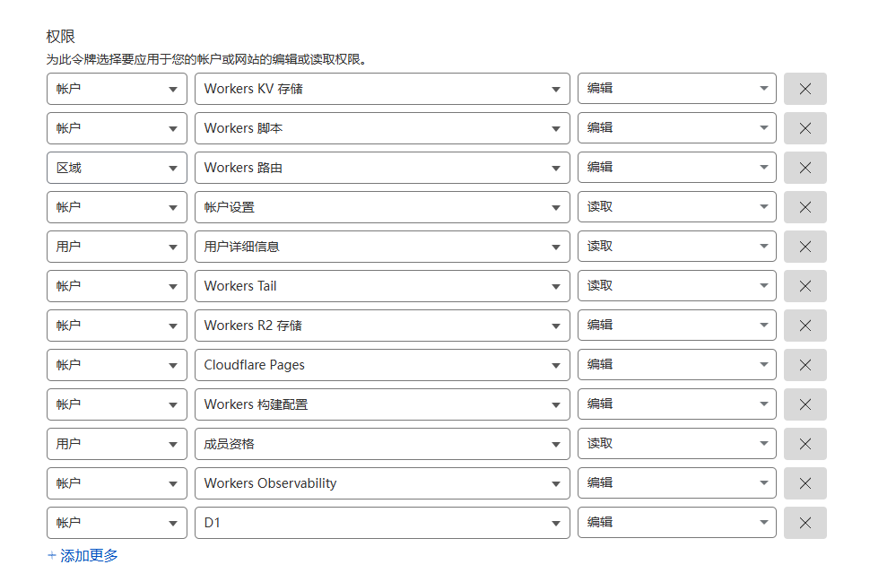
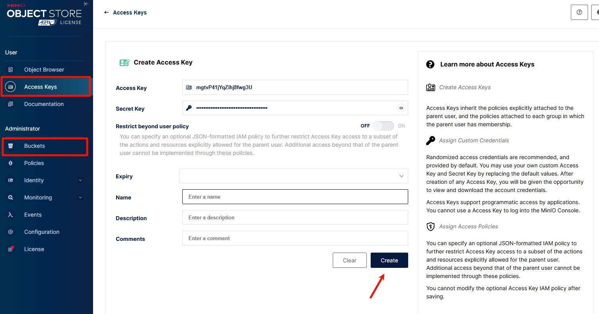
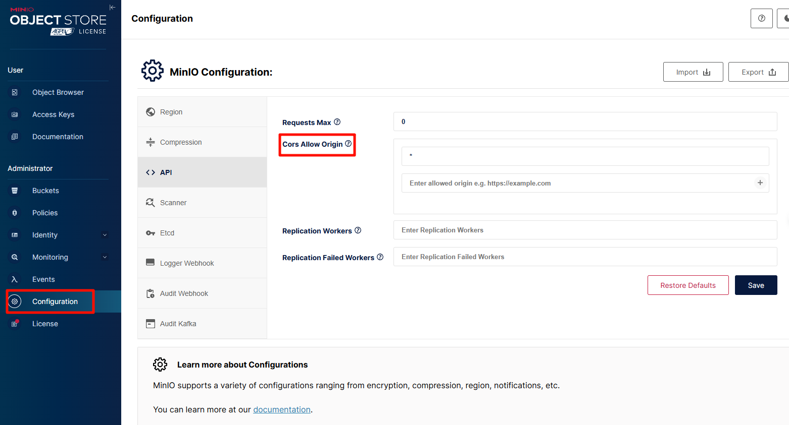

# CloudPaste - 在线剪贴板 📋

<div align="center">
    <p>
    <a href="README_CN.md">中文</a> | <a href="README.md">English</a> |
    <a href="https://www.readme-i18n.com/ling-drag0n/CloudPaste?lang=es">Español</a> | 
    <a href="https://www.readme-i18n.com/ling-drag0n/CloudPaste?lang=fr">français</a> | 
    <a href="https://www.readme-i18n.com/ling-drag0n/CloudPaste?lang=ja">日本語</a> 
    </p>
    
    <h3>基于 Cloudflare 的在线剪贴板和文件分享服务，支持 Markdown 编辑和文件上传</h3>
</div>

<div align="center">
    <a href="https://deepwiki.com/ling-drag0n/CloudPaste"></a>
    <a href="./LICENSE"></a>
    <a href="https://github.com/ling-drag0n/CloudPaste/stargazers"></a>
    <a href="https://www.cloudflare.com/"></a>
    <a href="https://hub.docker.com/r/dragon730/cloudpaste-backend"></a>
</div>

<p align="center">
  <a href="#-展示">📸 展示</a> •
  <a href="#-特点">✨ 特点</a> •
  <a href="#-部署教程">🚀 部署教程</a> •
  <a href="#-技术栈">🔧 技术栈</a> •
  <a href="#-开发">💻 开发</a> •
  <a href="#-许可证">📄 许可证</a>
</p>

## 📸 部分展示

<table align="center">
  <tr>
    <td></td>
    <td></td>
  </tr>
  <tr>
    <td></td>
    <td></td>
  </tr>
  <tr>
    <td></td>
    <td></td>
  </tr>
  <tr>
    <td></td>
    <td></td>
  </tr>
</table>

## ✨ 特点

### 📝 Markdown 编辑与分享

- **强大的编辑器**：集成 [Vditor](https://github.com/Vanessa219/vditor)，支持 GitHub 风格的 Markdown、数学公式、流程图、思维导图等
- **安全分享**：内容可设置访问密码保护
- **灵活时效**：支持设置内容过期时间
- **访问控制**：可限制最大查看次数
- **个性化**：自定义分享链接及备注
- **支持文本 Raw 直链**：类似 gihub 的 Raw 直链，用于 yaml 配置文件来启动的服务
- **多格式导出**：支持 PDF、Markdown、HTML、PNG 图片、Word 文档 导出
- **便捷分享**：一键复制分享链接和生成二维码
- **自动保存**：支持自动保存草稿功能

### 📤 文件上传与管理

- **多存储支持**：兼容多种 S3 存储服务 (Cloudflare R2、Backblaze B2、AWS S3 等)
- **存储配置**：可视化界面配置多个存储空间，灵活切换默认存储源
- **高效上传**：通过预签名 URL 直接上传至 S3 存储，多文件上传
- **实时反馈**：上传进度实时显示
- **自定义限制**：单次上传限制和最大容量限制
- **元数据管理**：文件备注、密码、过期时间、访问限制
- **数据分析**：文件访问统计与趋势分析
- **服务器直传**：支持调接口进行文件上传、下载等操作

### 🛠 便捷的文件/文本操作

- **统一管理**：支持文件/文本创建、删除和属性修改
- **在线预览**：常见文档、图片和媒体文件的在线预览与直链生成
- **分享工具**：生成短链接和二维码，便于跨平台分享
- **批量管理**：文件/文本批量操作与显示

### 🔄 WebDAV 和挂载点管理

- **WebDAV 协议支持**：通过标准 WebDAV 协议访问和管理文件系统
- **网络驱动器挂载**：支持 部分第三方客户端直接挂载
- **灵活的挂载点**：支持创建多个挂载点，连接不同的存储服务
- **权限控制**：精细的挂载点访问权限管理
- **API 密钥集成**：通过 API 密钥授权 WebDAV 访问
- **大文件支持**：自动使用分片上传机制处理大文件
- **目录操作**：完整支持目录创建、上传、删除、重命名等操作

### 🔐 轻量权限管理

#### 管理员权限控制

- **系统管理**：全局系统设置配置
- **内容审核**：所有用户内容的管理
- **存储管理**：S3 存储服务的添加、编辑与删除
- **权限分配**：API 密钥的创建与权限管理
- **数据分析**：完整的统计数据访问

#### API 密钥权限控制

- **文本权限**：创建/编辑/删除文本内容
- **文件权限**：上传/管理/删除文件
- **存储权限**：可选择特定的存储配置
- **读写分离**：可设置只读或读写权限
- **时效控制**：自定义有效期（从小时到月）
- **安全机制**：自动失效与手动撤销功能

### 💫 系统功能

- **适配性强**：响应式设计，适配移动设备和桌面
- **多语言**：中/英文双语界面支持
- **视觉模式**：明亮/暗黑主题切换
- **安全认证**：基于 JWT 的管理员认证系统
- **离线体验**：PWA 支持，可离线使用和安装到桌面

## 🚀 部署教程

### 前期准备

在开始部署前，请确保您已准备以下内容：

- [ ] [Cloudflare](https://dash.cloudflare.com) 账号（必需）
- [ ] 如使用 R2：开通 **Cloudflare R2** 服务并创建存储桶（需绑定支付方式）
- [ ] 如使用 Vercel：注册 [Vercel](https://vercel.com) 账号
- [ ] 其他 S3 存储服务的配置信息：
   - `S3_ACCESS_KEY_ID`
   - `S3_SECRET_ACCESS_KEY`
   - `S3_BUCKET_NAME`
   - `S3_ENDPOINT`

**以下教程可能过时 具体参考： [Cloudpaste在线部署文档](https://doc.cloudpaste.qzz.io)**


<details>
<summary><b>👉 查看完整部署教程</b></summary>

### 📑 目录

- [Action 自动部署](#Action自动部署:)
   - [后端自动部署](#后端自动部署)
   - [前端自动部署](#前端自动部署)
- [手动部署](#手动部署:)
   - [后端手动部署](#后端手动部署)
   - [前端手动部署](#前端手动部署)
- [ClawCloud 部署 CloudPaste 教程](#ClawCloud部署CloudPaste教程)

---

## Action 自动部署:

使用 GitHub Actions 可以实现代码推送后自动部署应用。

### 配置 GitHub 仓库

1. Fork 或克隆仓库 [https://github.com/ling-drag0n/CloudPaste](https://github.com/ling-drag0n/CloudPaste)
2. 进入您的 GitHub 仓库设置
3. 转到 Settings → Secrets and variables → Actions → New Repository secrets
4. 添加以下 Secrets：

| Secret 名称             | 必需 | 用途                                                  |
| ----------------------- | ---- | ----------------------------------------------------- |
| `CLOUDFLARE_API_TOKEN`  | ✅   | Cloudflare API 令牌（需要 Workers、D1 和 Pages 权限） |
| `CLOUDFLARE_ACCOUNT_ID` | ✅   | Cloudflare 账户 ID                                    |
| `ENCRYPTION_SECRET`     | ❌   | 用于加密敏感数据的密钥（如不提供，将自动生成）        |

#### 获取 Cloudflare API 令牌

1. 访问 [Cloudflare Dashboard](https://dash.cloudflare.com/profile/api-tokens)
2. 创建新的 API 令牌
3. 选择"编辑 Cloudflare Workers"模板，并添加 D1 数据库编辑权限

   

### 后端自动部署

Fork 仓库，填好密钥，然后运行工作流!!!
每当 `backend` 目录中的文件有更改并推送到 `main` 或 `master` 分支时，会自动触发部署。工作流程如下：

1. **自动创建 D1 数据库**（如果不存在）
2. **用 schema.sql 初始化数据库**（创建表和初始数据）
3. **设置 ENCRYPTION_SECRET 环境变量**（从 GitHub Secrets 获取或自动生成）
4. 自动部署 Worker 到 Cloudflare
5. 建议设置自定义域名代替 Cloudflare 原本提供的域名(否则国内无法访问)

**<span style="color:red">⚠️ 记住你的后端域名 </span>**

### 前端自动部署

#### Cloudflare Pages(推荐)

Fork 仓库，填好密钥，然后运行工作流
每当 `frontend` 目录中的文件有更改并推送到 `main` 或 `master` 分支时，会自动触发部署。部署后需在 Cloudflare Pages 控制面板设置环境变量：

1. 登录 [Cloudflare Dashboard](https://dash.cloudflare.com/)
2. 导航到 Pages → 您的项目（如 "cloudpaste-frontend"）
3. 点击 "Settings" → "Environment variables"
4. 添加环境变量：

   - 名称：`VITE_BACKEND_URL`
   - 值：刚刚部署的后端 Worker URL（如 `https://cloudpaste-backend.your-username.workers.dev`），末尾不带"/", 同时建议使用自定义的 worker 后端域名。

   - **<span style="color:red">一定要完整的填写后端域名,"https://xxxx.com" 格式</span>**

5. 重要步骤： 随后要再次运行一遍前端的工作流，以便完成后端域名加载！！！

   

**<span style="color:red">务必严格按照步骤操作，否则会出现后端域名加载失败</span>**
**<span style="color:red">⚠️ 安全提示：请在系统初始化后立即修改默认管理员密码（用户名: admin, 密码: admin123）。</span>**

#### Vercel

Vercel 建议使用以下方式部署：

1. Fork 后导入 GitHub 项目
2. 配置部署参数：

```
Framework Preset（框架预设）: Vite
Build Command（构建命令）: npm run build
Output Directory（输出目录）: dist
Install Command（安装命令）: npm install
```

3. 在下面配置环境变量：输入：VITE_BACKEND_URL 和你的后端域名
4. 点击 "Deploy" 按钮进行部署

☝️ **以上二选一即可**

---

## 手动部署:

### 后端手动部署

1. 克隆仓库

```bash
git clone https://github.com/ling-drag0n/CloudPaste.git
cd CloudPaste/backend
```

2. 安装依赖

   ```bash
   npm install
   ```

3. 登录 Cloudflare

   ```bash
   npx wrangler login
   ```

4. 创建 D1 数据库

   ```bash
   npx wrangler d1 create cloudpaste-db
   ```

   记下输出的数据库 ID。

5. 修改 wrangler.toml 配置

   ```toml
   [[d1_databases]]
   binding = "DB"
   database_name = "cloudpaste-db"
   database_id = "您的数据库ID"
   ```

6. 部署 Worker

   ```bash
   npx wrangler deploy
   ```

   记下输出的 URL，这是您的后端 API 地址。

7. 初始化数据库（自动）
   访问您的 Worker URL 触发初始化：

   ```
   https://cloudpaste-backend.your-username.workers.dev
   ```

**<span style="color:red">⚠️ 安全提示：请在系统初始化后立即修改默认管理员密码（用户名: admin, 密码: admin123）。</span>**

### 前端手动部署

#### Cloudflare Pages

1. 准备前端代码

   ```bash
   cd CloudPaste/frontend
   npm install
   ```

2. 配置环境变量
   创建或修改 `.env.production` 文件：

   ```
   VITE_BACKEND_URL=https://cloudpaste-backend.your-username.workers.dev
   VITE_APP_ENV=production
   VITE_ENABLE_DEVTOOLS=false
   ```

3. 构建前端项目

   ```bash
   npm run build
   ```

   [构建时需注意！！](https://github.com/ling-drag0n/CloudPaste/issues/6#issuecomment-2818746354)

4. 部署到 Cloudflare Pages

   **方法一**：通过 Wrangler CLI

   ```bash
   npx wrangler pages deploy dist --project-name=cloudpaste-frontend
   ```

   **方法二**：通过 Cloudflare Dashboard

   1. 登录 [Cloudflare Dashboard](https://dash.cloudflare.com/)
   2. 选择 "Pages"
   3. 点击 "Create a project" → "Direct Upload"
   4. 上传 `dist` 目录内的文件
   5. 设置项目名称（如 "cloudpaste-frontend"）
   6. 点击 "Save and Deploy"

#### Vercel

1. 准备前端代码

   ```bash
   cd CloudPaste/frontend
   npm install
   ```

2. 安装并登录 Vercel CLI

   ```bash
   npm install -g vercel
   vercel login
   ```

3. 配置环境变量，与 Cloudflare Pages 相同
4. 构建并部署

   ```bash
   vercel --prod
   ```

   根据提示配置项目。

---

## ClawCloud 部署 CloudPaste 教程

#### 每月 10G 免费流量，只适合轻度使用

###### Step 1:

注册链接：[Claw Cloud](https://ap-northeast-1.run.claw.cloud/signin) （不带#AFF）
不需要信用卡，只要 GitHub 注册日期大于 180 天，每个月都送 5 美金额度。

###### Step 2:

注册后，在首页点击 APP Launchpad 进入，然后点击右上角的 create app


###### Step 3:

先是部署后端，如图所示（仅供参考）：


后端的数据存储就是这里：


###### Step 4:

然后是前端，如图所示（仅供参考）：


##### 部署完成即可使用，可根据需要自定义域名

</details>

<details>
<summary><b>👉 Docker部署教程</b></summary>

### 📑 目录

- [Docker 命令行部署](#Docker命令行部署:)
   - [后端 Docker 部署](#后端Docker部署)
   - [前端 Docker 部署](#前端Docker部署)
- [Docker Compose 一键部署](#Docker-Compose一键部署:)

---

## Docker 命令行部署:

### 后端 Docker 部署

CloudPaste 后端支持通过官方 Docker 镜像快速部署。

1. 创建数据存储目录

   ```bash
   mkdir -p sql_data
   ```

2. 运行后端容器

   ```bash
   docker run -d --name cloudpaste-backend \
     -p 8787:8787 \
     -v $(pwd)/sql_data:/data \
     -e ENCRYPTION_SECRET=您的加密密钥 \
     -e NODE_ENV=production \
     -e RUNTIME_ENV=docker \
     dragon730/cloudpaste-backend:latest
   ```

   记下部署的 URL（如 `http://your-server-ip:8787`），后续前端部署需要用到。

**<span style="color:red">⚠️ 安全提示：请务必自定义 ENCRYPTION_SECRET 并保存好，此密钥用于加密敏感数据。</span>**

### 前端 Docker 部署

前端使用 Nginx 提供服务，并在启动时配置后端 API 地址。

```bash
docker run -d --name cloudpaste-frontend \
  -p 80:80 \
  -e BACKEND_URL=http://your-server-ip:8787 \
  dragon730/cloudpaste-frontend:latest
```

**<span style="color:red">⚠️ 注意：BACKEND_URL 必须包含完整 URL（包括协议 http:// 或 https://）</span>**
**<span style="color:red">⚠️ 安全提示：请在系统初始化后立即修改默认管理员密码（用户名: admin, 密码: admin123）。</span>**

### Docker 镜像更新

当项目发布新版本时，您可以按以下步骤更新 Docker 部署：

1. 拉取最新镜像

   ```bash
   docker pull dragon730/cloudpaste-backend:latest
   docker pull dragon730/cloudpaste-frontend:latest
   ```

2. 停止并移除旧容器

   ```bash
   docker stop cloudpaste-backend cloudpaste-frontend
   docker rm cloudpaste-backend cloudpaste-frontend
   ```

3. 使用上述相同的运行命令启动新容器（保留数据目录和配置）

## Docker-Compose 一键部署:

使用 Docker Compose 可以一键部署前后端服务，是最简单推荐的方式。

1. 创建 `docker-compose.yml` 文件

```yaml
version: "3.8"

services:
  frontend:
    image: dragon730/cloudpaste-frontend:latest
    environment:
      - BACKEND_URL=https://xxx.com # 填写后端服务地址
    ports:
      - "8080:80" #"127.0.0.1:8080:80"
    depends_on:
      - backend # 依赖backend服务
    networks:
      - cloudpaste-network
    restart: unless-stopped

  backend:
    image: dragon730/cloudpaste-backend:latest
    environment:
      - NODE_ENV=production
      - RUNTIME_ENV=docker
      - PORT=8787
      - ENCRYPTION_SECRET=自定义密钥 # 请修改为您自己的安全密钥
    volumes:
      - ./sql_data:/data # 数据持久化
    ports:
      - "8787:8787" #"127.0.0.1:8787:8787"
    networks:
      - cloudpaste-network
    restart: unless-stopped

networks:
  cloudpaste-network:
    driver: bridge
```

2. 启动服务

```bash
docker-compose up -d
```

**<span style="color:red">⚠️ 安全提示：请在系统初始化后立即修改默认管理员密码（用户名: admin, 密码: admin123）。</span>**

3. 访问服务

前端: `http://your-server-ip:80`
后端: `http://your-server-ip:8787`

### Docker Compose 更新

当需要更新到新版本时：

1. 拉取最新镜像

   ```bash
   docker-compose pull
   ```

2. 使用新镜像重新创建容器（保留数据卷）

   ```bash
   docker-compose up -d --force-recreate
   ```

**<span style="color:orange">💡 提示：如果遇到配置变更，可能需要备份数据后修改 docker-compose.yml 文件</span>**

### Nginx 反代示例（仅供参考）

```nginx
server {
    listen 443 ssl;
    server_name paste.yourdomain.com;  # 替换为您的域名

    # SSL 证书配置
    ssl_certificate     /path/to/cert.pem;  # 替换为证书路径
    ssl_certificate_key /path/to/key.pem;   # 替换为密钥路径

    # 前端代理配置
    location / {
        proxy_pass http://localhost:80;  # Docker前端服务地址
        proxy_set_header Host $host;
        proxy_set_header X-Real-IP $remote_addr;
    }

    # 后端API代理配置
    location /api {
        proxy_pass http://localhost:8787;  # Docker后端服务地址
        proxy_set_header Host $host;
        proxy_set_header X-Real-IP $remote_addr;
        client_max_body_size 0;

        # WebSocket支持 (如果需要)
        proxy_http_version 1.1;
        proxy_set_header Upgrade $http_upgrade;
        proxy_set_header Connection "upgrade";
    }

    # WebDav 配置
    location /dav/ {
        proxy_pass http://localhost:8787/dav/;  # 指向您的后端服务

        # WebDAV 必要头信息
        proxy_set_header Host $host;
        proxy_set_header X-Real-IP $remote_addr;
        proxy_set_header X-Forwarded-For $proxy_add_x_forwarded_for;

        # WebDAV 方法支持
        proxy_pass_request_headers on;

        # 支持所有WebDAV方法
        proxy_method $request_method;

        # 必要的头信息处理
        proxy_set_header Destination $http_destination;
        proxy_set_header Overwrite $http_overwrite;

        # 处理大文件
        client_max_body_size 0;

        # 超时设置
        proxy_connect_timeout 3600s;
        proxy_send_timeout 3600s;
        proxy_read_timeout 3600s;
    }
}
```

**<span style="color:red">⚠️ 安全提示：建议配置 HTTPS 和反向代理（如 Nginx）以提升安全性。</span>**

</details>

<details>
<summary><b>👉 S3相关跨域配置教程</b></summary>

## R2 API 相关获取及跨域配置

1. 登录 Cloudflare Dashboard
2. 点击 R2 存储，创建一个存储桶。
3. 创建 API 令牌
   
   

4. 创建后把全部数据都保存好，后续要用
5. 配置跨域规则，点击对应存储桶，点击设置，编辑 CORS 策略，如下所示：

```json
[
  {
    "AllowedOrigins": ["http://localhost:3000", "https://根据自己的前端域名来替代"],
    "AllowedMethods": ["GET", "PUT", "POST", "DELETE", "HEAD"],
    "AllowedHeaders": ["*"],
    "ExposeHeaders": ["ETag"],
    "MaxAgeSeconds": 3600
  }
]
```

## B2 API 相关获取及跨域配置

1. 若没有 B2 账号，可以先[注册](https://www.backblaze.com/sign-up/cloud-storage?referrer=getstarted)一个，然后创建一个存储桶。
   
2. 点击侧边栏的 Application Key，点击 Create Key，然后如图所示。
   
3. 配置 B2 的跨域，B2 跨域配置比较麻烦，需注意
   
4. 可以先尝试一下 1 或 2，去到上传页面看看是否能上传，F12 打开控制台若显示跨域错误，则使用 3。要一劳永逸就直接使用 3。

   

关于 3 的配置由于面板无法配置，只能手动配置，需[下载 B2 CLI](https://www.backblaze.com/docs/cloud-storage-command-line-tools)对应工具。具体可以参考："https://docs.cloudreve.org/zh/usage/storage/b2 " 。

下载后，在对应下载目录 cmd，在命令行输入以下命令：

```txt
b2-windows.exe account authorize   //进行账号登录，根据提示填入之前的 keyID 和 applicationKey
b2-windows.exe bucket get <bucketName> //你可以执行获取bucket信息，<bucketName>换成桶名字
```

windows 配置，采用“.\b2-windows.exe xxx”，
所以在对应 cli 的 exe 文件夹中 cmd 输入，python 的 cli 也同理：

```cmd
b2-windows.exe bucket update <bucketName> allPrivate --cors-rules "[{\"corsRuleName\":\"CloudPaste\",\"allowedOrigins\":[\"*\"],\"allowedHeaders\":[\"*\"],\"allowedOperations\":[\"b2_upload_file\",\"b2_download_file_by_name\",\"b2_download_file_by_id\",\"s3_head\",\"s3_get\",\"s3_put\",\"s3_post\",\"s3_delete\"],\"exposeHeaders\":[\"Etag\",\"content-length\",\"content-type\",\"x-bz-content-sha1\"],\"maxAgeSeconds\":3600}]"
```

其中<bucketName>换成你的存储桶名字，关于允许跨域的域名 allowedOrigins 可以根据个人配置，这里是允许所有。

5. 已完成跨域配置

## MinIO API 相关获取及跨域配置

1. **部署 MinIO 服务器**

   使用以下 Docker Compose 配置（参考）快速部署 MinIO 服务：

   ```yaml
   version: "3"

   services:
     minio:
       image: minio/minio:RELEASE.2025-02-18T16-25-55Z
       container_name: minio-server
       command: server /data --console-address :9001 --address :9000
       environment:
         - MINIO_ROOT_USER=minioadmin # 设置管理员用户名
         - MINIO_ROOT_PASSWORD=minioadmin # 设置管理员密码
         - MINIO_BROWSER=on
         - MINIO_SERVER_URL=https://minio.example.com # S3 API 访问地址
         - MINIO_BROWSER_REDIRECT_URL=https://console.example.com # 控制台访问地址
       ports:
         - "9000:9000" # S3 API 端口
         - "9001:9001" # 控制台端口
       volumes:
         - ./data:/data
         - ./certs:/root/.minio/certs # 如需配置SSL证书
       restart: always
   ```

   运行 `docker-compose up -d` 启动服务。

2. **配置反向代理（参考）**

   为确保 MinIO 服务正常工作，特别是文件预览功能，需要正确配置反向代理。以下是 OpenResty/Nginx 的推荐配置：

   **MinIO S3 API 反向代理 (minio.example.com)**:

   ```nginx
   location / {
       proxy_pass http://127.0.0.1:9000;
       proxy_set_header Host $host;
       proxy_set_header X-Real-IP $remote_addr;
       proxy_set_header X-Forwarded-For $proxy_add_x_forwarded_for;
       proxy_set_header X-Forwarded-Proto $scheme;

       # HTTP 连接优化
       proxy_http_version 1.1;
       proxy_set_header Connection "";  # 启用HTTP/1.1的keepalive

       # 关键配置：解决403错误和预览问题
       proxy_cache off;
       proxy_buffering off;
       proxy_request_buffering off;

       # 无文件大小限制
       client_max_body_size 0;
   }
   ```

   **MinIO 控制台反向代理 (console.example.com)**:

   ```nginx
   location / {
       proxy_pass http://127.0.0.1:9001;
       proxy_set_header Host $host;
       proxy_set_header X-Real-IP $remote_addr;
       proxy_set_header X-Forwarded-For $proxy_add_x_forwarded_for;
       proxy_set_header X-Forwarded-Proto $scheme;

       # WebSocket 支持
       proxy_http_version 1.1;
       proxy_set_header Upgrade $http_upgrade;
       proxy_set_header Connection "upgrade";

       # 关键配置
       proxy_cache off;
       proxy_buffering off;

       # 无文件大小限制
       client_max_body_size 0;
   }
   ```

3. **访问控制台创建存储桶和创建访问密钥**

   如有详细配置需求，可参考官方文档：https://min.io/docs/minio/container/index.html

   CN: https://min-io.cn/docs/minio/container/index.html

   

4. **相关配置（可选）**

   允许的源包含您的前端域名
   

5. **在 CloudPaste 中配置 MinIO**

   - 登录 CloudPaste 管理界面
   - 进入 "S3 存储配置" → "添加存储配置"
   - 选择 "其他兼容 S3 服务" 作为提供商类型
   - 填入以下信息：
      - 名称：自定义名称
      - 端点 URL：您的 MinIO 服务地址（如 `https://minio.example.com`）
      - 存储桶名称：之前创建的存储桶名称
      - 访问密钥 ID：您的 Access Key
      - 访问密钥：您的 Secret Key
      - 区域：可留空
      - 路径风格访问：必须启用！！！！
   - 点击 "测试连接" 确认配置正确
   - 保存配置

6. **注意与故障排查**

   - **注意事项**：如使用 Cloudfare 开启 cdn 可能需要加上 proxy_set_header Accept-Encoding "identity"，同时存在缓存问题，最好仅用 DNS 解析
   - **403 错误**：确保反向代理配置中包含 `proxy_cache off` 和 `proxy_buffering off`
   - **预览问题**：确保 MinIO 服务器正确配置了 `MINIO_SERVER_URL` 和 `MINIO_BROWSER_REDIRECT_URL`
   - **上传失败**：检查 CORS 配置是否正确，确保允许的源包含您的前端域名
   - **控制台无法访问**：检查 WebSocket 配置是否正确，特别是 `Connection "upgrade"` 设置

## 更多 S3 相关配置待续......

</details>

<details>
<summary><b>👉 WebDAV配置详细指南</b></summary>

## WebDAV 配置与使用详解

CloudPaste 提供简易的 WebDAV 协议支持，允许您将存储空间挂载为网络驱动器，便于直接通过文件管理器访问和管理文件。

### WebDAV 服务基本信息

- **WebDAV 基础 URL**: `https://你的后端域名/dav`
- **支持的认证方式**:
   - Basic 认证（用户名+密码）
- **支持的权限类型**:
   - 管理员账户 - 拥有完整操作权限
   - API 密钥 - 按需启用

### 权限配置

#### 1. 管理员账户访问

使用管理员账户和密码直接访问 WebDAV 服务：

- **用户名**: 管理员用户名
- **密码**: 管理员密码

#### 2. API 密钥访问（推荐）

为更安全的访问方式，建议创建专用 API 密钥：

1. 登录管理界面
2. 导航至"API 密钥管理"
3. 创建新 API 密钥，**确保启用"挂载权限"**
4. 使用方式：
   - **用户名**: API 密钥值
   - **密码**: 与用户名相同的 API 密钥值

### NGINX 反向代理配置

如果使用 NGINX 作为反向代理，需要添加特定的 WebDAV 配置以确保所有 WebDAV 方法正常工作：

```nginx
# WebDAV 配置
location /dav {
    proxy_pass http://localhost:8787;  # 指向您的后端服务

    # WebDAV 必要头信息
    proxy_set_header Host $host;
    proxy_set_header X-Real-IP $remote_addr;
    proxy_set_header X-Forwarded-For $proxy_add_x_forwarded_for;

    # WebDAV 方法支持
    proxy_pass_request_headers on;

    # 支持所有WebDAV方法
    proxy_method $request_method;

    # 必要的头信息处理
    proxy_set_header Destination $http_destination;
    proxy_set_header Overwrite $http_overwrite;

    # 处理大文件
    client_max_body_size 0;

    # 超时设置
    proxy_connect_timeout 3600s;
    proxy_send_timeout 3600s;
    proxy_read_timeout 3600s;
}
```

### 常见问题解决

1. **连接问题**:

   - 确认 WebDAV URL 格式正确
   - 验证认证凭据是否有效
   - 检查 API 密钥是否具有挂载权限

2. **权限错误**:

   - 确认账户具有所需的权限
   - 管理员账户应有完整权限
   - API 密钥需特别启用挂载权限

3. **⚠️⚠️ Webdav 上传问题**:

   - Worker部署的webdav上传大小可能受限于CF的CDN限制 100MB左右，导致报错413
   - 对于 Docker 部署，只需注意 nginx 代理配置，上传模式任意。

</details>

## 🔧 技术栈

### 前端

- **框架**: Vue.js 3 + Vite
- **样式**: TailwindCSS
- **编辑器**: Vditor
- **国际化**: Vue-i18n
- **图表**: Chart.js + Vue-chartjs

### 后端

- **运行时**: Cloudflare Workers
- **框架**: Hono
- **数据库**: Cloudflare D1 (SQLite)
- **存储**: 多 S3 兼容服务 (支持 R2, B2, AWS S3)
- **认证**: JWT 令牌 + API 密钥

## 💻 开发

### API 文档

[API 文档](Api-doc.md)

[服务器 文件直传 API 文档](Api-s3_direct.md) - 服务器 文件直传接口详细说明

### 本地开发设置

1. **克隆项目仓库**

   ```bash
   git clone https://github.com/ling-drag0n/cloudpaste.git
   cd cloudpaste
   ```

2. **后端设置**

   ```bash
   cd backend
   npm install
   # 初始化 D1 数据库
   wrangler d1 create cloudpaste-db
   wrangler d1 execute cloudpaste-db --file=./schema.sql
   ```

3. **前端设置**

   ```bash
   cd frontend
   npm install
   ```

4. **配置环境变量**

   - 在 `backend` 目录下，创建 `wrangler.toml` 文件设置开发环境变量
   - 在 `frontend` 目录下，配置 `.env.development` 文件设置前端环境变量

5. **启动开发服务器**

   ```bash
   # 后端
   cd backend
   npm run dev

   # 前端 (另一个终端)
   cd frontend
   npm run dev
   ```

### 项目结构

```
CloudPaste/
├── frontend/                # 前端 Vue.js 应用
│   ├── src/                 # 源代码
│   │   ├── components/      # Vue 组件
│   │   ├── api/             # API 客户端和服务
│   │   ├── i18n/            # 国际化资源文件
│   │   ├── utils/           # 工具函数
│   │   └── assets/          # 静态资源
│   └── ...
└── backend/                 # Cloudflare Workers 后端
    ├── worker.js            # 主要 Worker 文件
    ├── schema.sql           # D1 数据库模式
    └── ...
```

### 自定义 Docker 构建

如果您希望自定义 Docker 镜像或进行开发调试，可以按照以下步骤手动构建：

1. **构建后端镜像**

   ```bash
   # 在项目根目录执行
   docker build -t cloudpaste-backend:custom -f docker/backend/Dockerfile .

   # 运行自定义构建的镜像
   docker run -d --name cloudpaste-backend \
     -p 8787:8787 \
     -v $(pwd)/sql_data:/data \
     -e ENCRYPTION_SECRET=开发测试密钥 \
     cloudpaste-backend:custom
   ```

2. **构建前端镜像**

   ```bash
   # 在项目根目录执行
   docker build -t cloudpaste-frontend:custom -f docker/frontend/Dockerfile .

   # 运行自定义构建的镜像
   docker run -d --name cloudpaste-frontend \
     -p 80:80 \
     -e BACKEND_URL=http://localhost:8787 \
     cloudpaste-frontend:custom
   ```

3. **开发环境 Docker Compose**

   创建 `docker-compose.dev.yml` 文件：

   ```yaml
   version: "3.8"

   services:
     frontend:
       build:
         context: .
         dockerfile: docker/frontend/Dockerfile
       environment:
         - BACKEND_URL=http://backend:8787
       ports:
         - "80:80"
       depends_on:
         - backend

     backend:
       build:
         context: .
         dockerfile: docker/backend/Dockerfile
       environment:
         - NODE_ENV=development
         - RUNTIME_ENV=docker
         - PORT=8787
         - ENCRYPTION_SECRET=dev_secret_key
       volumes:
         - ./sql_data:/data
       ports:
         - "8787:8787"
   ```

   启动开发环境：

   ```bash
   docker-compose -f docker-compose.yml up --build
   ```

## 📄 许可证

Apache License 2.0

本项目使用 Apache License 2.0 许可证 - 详情请参阅 [LICENSE](LICENSE) 文件。

## ❤️ 贡献
- **赞助**：项目维护不易，喜欢本项目的话，可以作者大大一点小小的鼓励哦，您的每一份支持都是我前进的动力\~

  <a href="https://afdian.com/a/drag0n"></a>

- **赞助者**：非常感谢以下赞助者对本项目的支持！！

   [](https://afdian.com/a/drag0n)

- **Contributors**：感谢以下贡献者对本项目的无私贡献！
  [](https://github.com/ling-drag0n/CloudPaste/graphs/contributors)

## Star History

[](https://star-history.com/#ling-drag0n/CloudPaste&Date)

**如果觉得项目不错希望您能给个免费的 star✨✨，非常感谢！**
